# 🦸‍♂️ My Hero Academia API

[](https://dotnet.microsoft.com/)
[](https://docs.microsoft.com/en-us/dotnet/csharp/)
[](https://docs.microsoft.com/en-us/ef/)
[](LICENSE)

> A comprehensive REST API for managing Heroes, Villains, Quirks, and Items from the My Hero Academia universe. Built with clean architecture principles and modern .NET practices.

## 📋 Table of Contents

- [🚀 Features](#-features)
- [🏗️ Architecture](#️-architecture)
- [📦 Installation](#-installation)
- [⚙️ Configuration](#️-configuration)
- [🔧 Usage](#-usage)
- [📚 API Documentation](#-api-documentation)
- [🗄️ Database Schema](#️-database-schema)


## 🚀 Features

- **🦸‍♂️ Hero Management**: Complete CRUD operations for heroes with professional rankings and affiliations
- **🦹‍♂️ Villain Management**: Comprehensive villain data management with gang affiliations
- **⚡ Quirk System**: Manage supernatural abilities with type classification and weakness tracking
- **📦 Item Management**: Track equipment and support gadgets owned by heroes or villains
- **🖼️ Image Handling**: Upload and manage character profile images with validation
- **🗑️ Soft Delete**: Safe deletion with data preservation and recovery capabilities
- **🔄 Unit of Work Pattern**: Consistent transaction management across operations
- **🗺️ AutoMapper Integration**: Seamless DTO to entity mapping
- **📊 Structured Logging**: Comprehensive error tracking and monitoring
- **🔍 Query Filtering**: Automatic exclusion of deleted entities from queries

## 🏗️ Architecture

The API follows a clean architecture pattern with distinct layers and separation of concerns:

```mermaid
graph TB
    subgraph "Presentation Layer"
        Controllers["🎮 Controllers"]
    end
    
    subgraph "Service Layer"
        HeroService["🦸‍♂️ HeroService"]
        VillainService["🦹‍♂️ VillainService"]
        QuirkService["⚡ QuirkService"]
        ItemService["📦 ItemService"]
        ImageService["🖼️ ImageService"]
    end
    
    subgraph "Data Access Layer"
        UnitOfWork["🔄 Unit of Work"]
        Repositories["📚 Repositories"]
        DbContext["🗄️ ApplicationDbContext"]
    end
    
    subgraph "Domain Layer"
        Entities["📋 Domain Entities"]
        DTOs["📄 Data Transfer Objects"]
    end
    
    Controllers --> HeroService
    Controllers --> VillainService
    Controllers --> QuirkService
    Controllers --> ItemService
    
    HeroService --> UnitOfWork
    VillainService --> UnitOfWork
    QuirkService --> UnitOfWork
    ItemService --> UnitOfWork
    
    HeroService --> ImageService
    VillainService --> ImageService
    
    UnitOfWork --> Repositories
    Repositories --> DbContext
    
    HeroService --> DTOs
    VillainService --> DTOs
    QuirkService --> DTOs
    ItemService --> DTOs
    
    DTOs --> Entities
```



### 🔧 Service Layer Components

The service layer implements consistent patterns across all domain services [1](#1-0) :

- **HeroService**: Manages hero entities with quirk validation and image handling [2](#1-1) 
- **VillainService**: Handles villain operations with similar validation patterns [3](#1-2) 
- **QuirkService**: Manages quirk entities with referential integrity checks [4](#1-3) 
- **ItemService**: Handles item management with owner validation [5](#1-4) 

## 📦 Installation

### Prerequisites

- **.NET 6.0 SDK** or later
- **SQL Server** (LocalDB or full instance)
- **Visual Studio 2022** or **VS Code** with C# extension
- **Git** for version control

### Setup Steps

1. **Clone the repository**
   ```bash
   git clone https://github.com/Gaitan19/MyHeroAcademiaApi.git
   cd MyHeroAcademiaApi
   ```

2. **Restore NuGet packages**
   ```bash
   dotnet restore
   ```

3. **Update database connection string**
   
   Edit `appsettings.json`:
   ```json
   {
     "ConnectionStrings": {
       "DefaultConnection": "Server=(localdb)\\mssqllocaldb;Database=MyHeroAcademiaDb;Trusted_Connection=true;MultipleActiveResultSets=true"
     }
   }
   ```

4. **Install Entity Framework tools** (if not already installed)
   ```bash
   dotnet tool install --global dotnet-ef
   ```

5. **Run database migrations**
   ```bash
   dotnet ef database update
   ```

6. **Create image directories**
   ```bash
   mkdir -p wwwroot/images/Hero
   mkdir -p wwwroot/images/Villain
   ```

7. **Start the application**
   ```bash
   dotnet run
   ```

8. **Access the API**
   - API: `https://localhost:7000` or `http://localhost:5000`
   - Swagger UI: `https://localhost:7000/swagger`

## ⚙️ Configuration

### Environment Variables

| Variable | Description | Default | Required |
|----------|-------------|---------|----------|
| `ASPNETCORE_ENVIRONMENT` | Application environment | `Development` | No |
| `ConnectionStrings__DefaultConnection` | Database connection string | LocalDB | Yes |
| `ImageSettings__MaxFileSize` | Maximum image file size (MB) | `5` | No |
| `ImageSettings__AllowedExtensions` | Allowed image extensions | `.jpg,.jpeg,.png,.gif` | No |
| `ImageSettings__StoragePath` | Image storage directory | `wwwroot/images` | No |

### Application Settings

```json
{
  "ConnectionStrings": {
    "DefaultConnection": "Server=(localdb)\\mssqllocaldb;Database=MyHeroAcademiaDb;Trusted_Connection=true;"
  },
  "ImageSettings": {
    "MaxFileSize": 5242880,
    "AllowedExtensions": [".jpg", ".jpeg", ".png", ".gif"],
    "StoragePath": "wwwroot/images"
  },
  "Logging": {
    "LogLevel": {
      "Default": "Information",
      "Microsoft.AspNetCore": "Warning"
    }
  }
}
```

### Image Storage Configuration

Images are organized in subdirectories by entity type:
```
wwwroot/
└── images/
    ├── Hero/
    │   ├── {hero-id}.jpg
    │   └── {hero-id}.png
    └── Villain/
        ├── {villain-id}.jpg
        └── {villain-id}.png
```

## 🔧 Usage

### Basic API Operations

#### 🦸‍♂️ Heroes
```http
GET    /api/heroes              # Get all heroes
GET    /api/heroes/{id}         # Get hero by ID
POST   /api/heroes              # Create new hero
PUT    /api/heroes/{id}         # Update hero
DELETE /api/heroes/{id}         # Delete hero (soft delete)
POST   /api/heroes/{id}/image   # Update hero image
```

#### 🦹‍♂️ Villains
```http
GET    /api/villains            # Get all villains
GET    /api/villains/{id}       # Get villain by ID
POST   /api/villains            # Create new villain
PUT    /api/villains/{id}       # Update villain
DELETE /api/villains/{id}       # Delete villain (soft delete)
POST   /api/villains/{id}/image # Update villain image
```

#### ⚡ Quirks
```http
GET    /api/quirks              # Get all quirks
GET    /api/quirks/{id}         # Get quirk by ID
POST   /api/quirks              # Create new quirk
PUT    /api/quirks/{id}         # Update quirk
DELETE /api/quirks/{id}         # Delete quirk (soft delete)
```

#### 📦 Items
```http
GET    /api/items               # Get all items
GET    /api/items/{id}          # Get item by ID
POST   /api/items               # Create new item
PUT    /api/items/{id}          # Update item
DELETE /api/items/{id}          # Delete item (soft delete)
GET    /api/items/owner/{id}    # Get items by owner (hero or villain)
```

### Sample Requests

#### Create a Hero
```json
POST /api/heroes
Content-Type: application/json

{
  "name": "Deku",
  "rank": "Student",
  "affiliation": "U.A. High School",
  "quirkId": "3fa85f64-5717-4562-b3fc-2c963f66afa6"
}
```

#### Create a Quirk
```json
POST /api/quirks
Content-Type: application/json

{
  "type": "Emitter",
  "effects": "Allows the user to stockpile and release kinetic energy",
  "weaknesses": "Causes severe physical backlash if overused"
}
```

### Error Handling

The API implements comprehensive error handling with structured logging [6](#1-5) . All service operations are wrapped in try-catch blocks that log errors and re-throw exceptions for proper HTTP status code mapping.

### Business Rules

- **Quirk Validation**: Heroes and villains must have valid, non-deleted quirks [7](#1-6) 
- **Soft Delete**: Entities are marked as deleted rather than physically removed [8](#1-7) 
- **Referential Integrity**: Quirks cannot be deleted if they're used by active heroes or villains
- **Item Ownership**: Items can belong to either a hero OR a villain, but not both
- **Image Management**: Optional image upload with validation and storage management

## 📚 API Documentation

### Data Transfer Objects (DTOs)

The API uses DTOs for clean separation between external contracts and internal domain models:

#### Hero DTOs
- `HeroDTO` - Complete hero information for responses
- `CreateHeroDTO` - Data required to create a new hero
- `UpdateHeroDTO` - Data for updating existing heroes

#### Villain DTOs
- `VillainDTO` - Complete villain information for responses
- `CreateVillainDTO` - Data required to create a new villain

#### Quirk DTOs
- `QuirkDTO` - Complete quirk information (used for both create and update)
- `CreateQuirkDTO` - Data required to create a new quirk

#### Item DTOs
- `ItemDTO` - Complete item information for responses
- `CreateItemDTO` - Data required to create a new item

### Response Formats

All API responses follow consistent JSON formatting with proper HTTP status codes:

| Status Code | Description | Usage |
|-------------|-------------|-------|
| `200 OK` | Successful retrieval | GET requests |
| `201 Created` | Successful creation | POST requests |
| `204 No Content` | Successful update/deletion | PUT/DELETE requests |
| `400 Bad Request` | Validation errors | Invalid input data |
| `404 Not Found` | Resource not found | Non-existent entities |
| `409 Conflict` | Business rule violation | Referential integrity issues |
| `500 Internal Server Error` | Server errors | Unexpected exceptions |

### Error Response Format
```json
{
  "type": "https://tools.ietf.org/html/rfc7231#section-6.5.1",
  "title": "Bad Request",
  "status": 400,
  "detail": "Quirk with ID 12345 does not exist",
  "traceId": "00-abc123-def456-00"
}
```

## 🗄️ Database Schema

The application uses Entity Framework Core with SQL Server and implements a soft delete pattern [9](#1-8) .

### Entity Relationships


### Database Configuration

The `ApplicationDbContext` configures entity relationships and query filters [10](#1-9) :

- **Soft Delete Filters**: Automatically exclude deleted entities from queries
- **Cascade Restrictions**: Prevent accidental deletion of referenced quirks
- **Foreign Key Constraints**: Maintain referential integrity

## 🧪 Testing

### Running Tests

```bash
# Run all tests
dotnet test

# Run with coverage report
dotnet test --collect:"XPlat Code Coverage"

# Run specific test project
dotnet test MyHeroAcademiaApi.Tests

# Run tests with detailed output
dotnet test --verbosity normal
```
